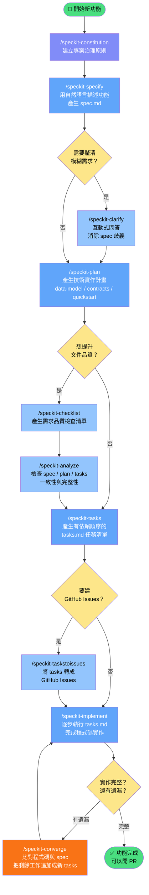

```mermaid 
flowchart TD
    START([🚀 開始新功能]) --> CONST

    CONST["/speckit-constitution\n建立專案治理原則"]
    CONST --> SPECIFY

    SPECIFY["/speckit-specify\n用自然語言描述功能\n產生 spec.md"]
    SPECIFY --> CLARIFY_Q{需要釐清\n模糊需求？}

    CLARIFY_Q -- 是 --> CLARIFY["/speckit-clarify\n互動式問答\n消除 spec 歧義"]
    CLARIFY --> PLAN
    CLARIFY_Q -- 否 --> PLAN

    PLAN["/speckit-plan\n產生技術實作計畫\ndata-model / contracts / quickstart"]
    PLAN --> QUALITY_Q{想提升\n文件品質？}

    QUALITY_Q -- 是 --> CHECKLIST["/speckit-checklist\n產生需求品質檢查清單"]
    QUALITY_Q -- 否 --> TASKS
    CHECKLIST --> ANALYZE

    ANALYZE["/speckit-analyze\n檢查 spec / plan / tasks\n一致性與完整性"]
    ANALYZE --> TASKS

    TASKS["/speckit-tasks\n產生有依賴順序的\ntasks.md 任務清單"]
    TASKS --> ISSUES_Q{要建\nGitHub Issues？}

    ISSUES_Q -- 是 --> TASKSTOISSUES["/speckit-taskstoissues\n將 tasks 轉成\nGitHub Issues"]
    ISSUES_Q -- 否 --> IMPLEMENT
    TASKSTOISSUES --> IMPLEMENT

    IMPLEMENT["/speckit-implement\n逐步執行 tasks.md\n完成程式碼實作"]
    IMPLEMENT --> CONVERGE_Q{實作完整？\n還有遺漏？}

    CONVERGE_Q -- 有遺漏 --> CONVERGE["/speckit-converge\n比對程式碼與 spec\n把剩餘工作追加成新 tasks"]
    CONVERGE --> IMPLEMENT
    CONVERGE_Q -- 完整 --> DONE([✅ 功能完成\n可以開 PR])

    style START fill:#4ade80,color:#000
    style DONE fill:#4ade80,color:#000
    style CONST fill:#818cf8,color:#fff
    style SPECIFY fill:#60a5fa,color:#fff
    style CLARIFY fill:#93c5fd,color:#000
    style PLAN fill:#60a5fa,color:#fff
    style CHECKLIST fill:#93c5fd,color:#000
    style ANALYZE fill:#93c5fd,color:#000
    style TASKS fill:#60a5fa,color:#fff
    style IMPLEMENT fill:#60a5fa,color:#fff
    style CONVERGE fill:#f97316,color:#fff
    style TASKSTOISSUES fill:#93c5fd,color:#000
    style CLARIFY_Q fill:#fde68a,color:#000
    style QUALITY_Q fill:#fde68a,color:#000
    style ISSUES_Q fill:#fde68a,color:#000
    style CONVERGE_Q fill:#fde68a,color:#000
```